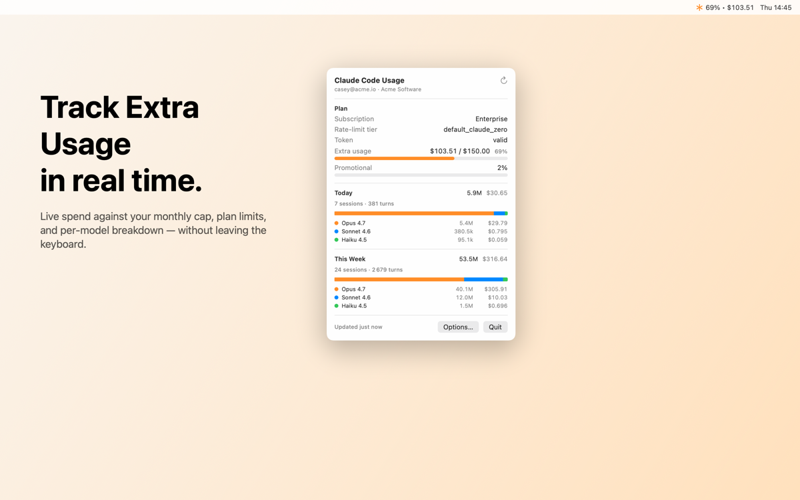
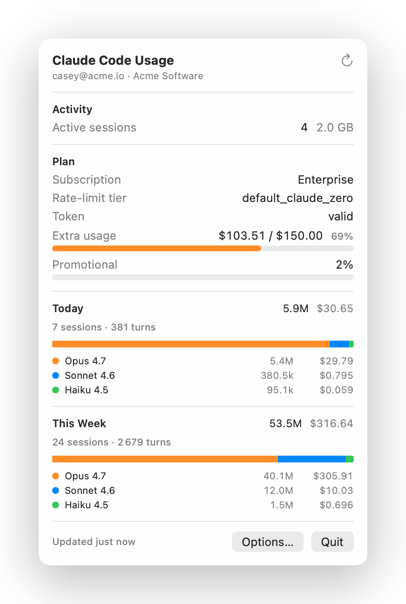
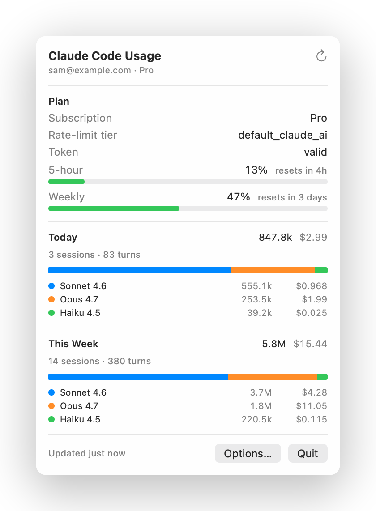
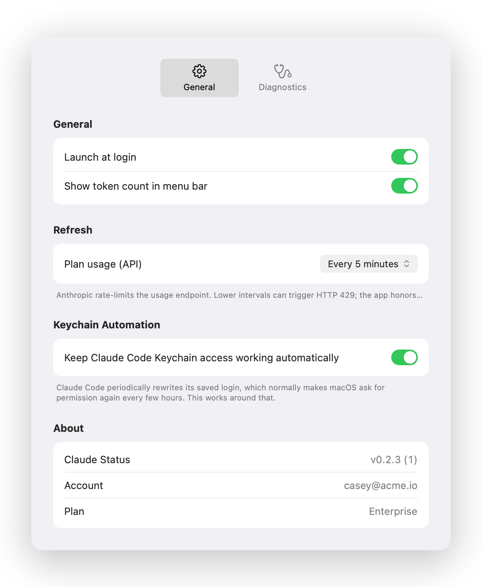

# Claude Status

> macOS menu bar app for Claude Code usage. Live plan limits, today's spend, weekly cap, and per-model breakdown — without leaving the keyboard.


<p align="center">
  <a href="https://claudestatus.runlocal.dev/">
    
  </a>
</p>

<p align="center">
  <a href="https://claudestatus.runlocal.dev/"><strong>claudestatus.runlocal.dev</strong></a>
</p>

---

## Why

Claude Code logs every assistant turn locally in `~/.claude/projects/**/*.jsonl`, and Anthropic exposes per-plan usage at `api.anthropic.com/api/oauth/usage`. **Claude Status** stitches both together into a tiny native menu-bar item so you can answer "how much did today cost me?" / "am I about to hit my weekly cap?" without opening a browser.

- **Reuses your existing Claude Code login** — reads the OAuth blob from the macOS Keychain. No new accounts, no API keys.
- **Plan-aware** — Enterprise Extra Usage in USD, Pro/Max 5-hour + weekly buckets, per-model breakdown (Opus / Sonnet / Haiku).
- **Local-first** — token counts come from your existing `*.jsonl` logs. The API call is configurable and can be turned off entirely.
- **Native** — Swift + SwiftUI `MenuBarExtra`. ~1.5k lines. No Electron, no background daemons.

## Install

```bash
brew tap bcollard/tap
brew install --cask claude-status
```

Or grab the latest `.dmg` from the [Releases](https://github.com/bcollard/claude-status-macos-menu-bar/releases) page.

Requirements:

- macOS 14 Sonoma or later
- Apple Silicon (universal build coming)
- An active Claude Code login (the app reads from its Keychain entry)

The release build is signed with a Developer ID and notarized by Apple, so Gatekeeper opens it without warnings.

## Screenshots

<table>
  <tr>
    <td align="center">
      <br>
      <sub><b>Enterprise.</b> Live Extra Usage spend against monthly cap.</sub>
    </td>
    <td align="center">
      <br>
      <sub><b>Pro / Max.</b> 5-hour and weekly utilization with reset timers.</sub>
    </td>
  </tr>
  <tr>
    <td colspan="2" align="center">
      <br>
      <sub><b>Options.</b> Pick how often the API gets polled — or turn it off entirely.</sub>
    </td>
  </tr>
</table>

## How it works

Three honest pieces of plumbing:

1. **Keychain** — reads the OAuth blob Claude Code wrote to `svce="Claude Code-credentials"`. Picks the freshest entry by `expiresAt` (Claude Code may leave older `acct=<username>` and `acct=claude-code-user` entries around after an SSO re-login).
2. **Local logs** — streams `~/.claude/projects/**/*.jsonl` line by line, filters by timestamp window, aggregates *input / output / cache-read / cache-write* per model.
3. **OAuth usage API** — `GET https://api.anthropic.com/api/oauth/usage` with the Bearer token. Honors `Retry-After` on 429s, keeps the last good values on screen during backoff.

```
┌────────────────────────┐    ┌───────────────────────────┐
│ ~/.claude/projects/    │    │ macOS Keychain            │
│   **/*.jsonl           │    │   "Claude Code-           │
│   (token usage)        │    │    credentials"           │
└────────┬───────────────┘    └────────────┬──────────────┘
         │                                 │
         ▼                                 ▼
   SessionLogScanner                 KeychainReader
         │                                 │
         └─────────────┬───────────────────┤
                       ▼                   ▼
                  UsageStore        UsageAPIClient ──► api.anthropic.com
                       │                   │             /api/oauth/usage
                       ▼                   │             (Bearer OAuth)
                   MenuView ◄──────────────┘
```

See [`CLAUDE.md`](CLAUDE.md) for the full architecture notes (Keychain shape, `/api/oauth/usage` response schema for both Enterprise and Pro, known limitations).

## Configuration

Open the dropdown → **Options…** (or press `⌘,`):

- **Launch at login** — registers via `SMAppService` (app must live in `/Applications` or `~/Applications`).
- **Show token count in menu bar** — toggles the title text next to the orange asterisk icon.
- **Plan usage (API) refresh** — every minute / 5 / 10 / 30 / 1 h / **Manual only**. Default 5 min.

The local-log scan runs every 60 s regardless and is not user-configurable (file I/O is cheap).

## Privacy

- No analytics, no telemetry, no third-party SDKs.
- One HTTPS call: `api.anthropic.com/api/oauth/usage` — the same endpoint Claude Code calls.
- Local logs stay on your Mac. Only the `usage` blocks are parsed; conversation content is never read.
- Keychain access prompts on first launch — choose **Always Allow**. Revoke any time via macOS *Keychain Access*.
- API polling is opt-out (Options → Refresh → *Manual only*).

## Build from source

```bash
git clone https://github.com/bcollard/claude-status-macos-menu-bar
cd claude-status-macos-menu-bar
./build.sh                                                # → .build/bundler/apps/ClaudeStatus/ClaudeStatus.app (ad-hoc signed)
cp -R .build/bundler/apps/ClaudeStatus/ClaudeStatus.app /Applications/
open /Applications/ClaudeStatus.app
```

Requires Xcode (for the Swift toolchain) and [swift-bundler](https://github.com/stackotter/swift-bundler). macOS 14 SDK or newer.

### Regenerating screenshots

```bash
./scripts/screenshots.sh
```

Outputs marketing canvases (2880×1800) to `docs/screenshots/` and clean popup + settings cards to `website/assets/`. All demo data is anonymous — no real account info leaks.

### Cutting a release

Bump `version` in `Bundler.toml` and `Casks/claude-status.rb`, then:

```bash
./scripts/release.sh
# → .build/bundler/apps/ClaudeStatus/ClaudeStatus.{zip,dmg}
# → signed with Developer ID, notarized + stapled, ready for upload
# → prints sha256 to paste into the cask formula
```

The script requires a `notarytool` keychain profile (default `claude-status-notary`):

```bash
xcrun notarytool store-credentials claude-status-notary \
  --apple-id you@example.com --team-id YOURTEAMID --password <app-specific-password>
```

## Limitations

- **Token refresh.** Claude Code refreshes OAuth tokens in-memory and doesn't always write back to the Keychain. If the API rows go quiet, run `claude /logout` then re-login to mint a fresh Keychain entry.
- **Notch overflow.** On notched MacBooks the menu bar can hide our icon behind the notch. Workarounds: ⌘-drag to reorder, quit another menu-bar app, or toggle off **Show token count in menu bar**.
- **Pricing maintenance.** `Pricing.swift` hardcodes per-million-token rates. Update when Anthropic publishes new pricing.
- **Not in the App Store.** Reading another app's Keychain entry from inside the App Store sandbox would need a shared keychain access group entitlement only Anthropic can grant. Homebrew cask avoids that.

## Related

- [`amirhayek.dev/ClaudeUsage`](https://amirhayek.dev/ClaudeUsage/) — paid Mac App Store app with similar goals, iOS companion, history charts.
- [`ccusage`](https://github.com/ryoppippi/ccusage) — Node CLI that aggregates Claude Code local logs.

## License

[MIT](LICENSE) © 2026 Baptiste Collard

Uses Apple SF Symbols under Apple's symbol license. Not affiliated with Anthropic.
